# Plague Tycoon

Plague Tycoon is a Godot-based optimization game about building the best possible production pipeline. You manage three linked stages:

- **Supply**: move human corpses from cities to the factory.
- **Factory**: place machines and process the corpses through sterilizing, cutting, and packaging.
- **Distribution**: ship packaged corpses efficiently to graveyards.

The game is built around comparing your setup against solver-driven optimal results, so the goal is not just to play, but to improve your route, layout, throughput, and delivery efficiency.

## What The Game Does

Each run asks you to make a series of optimization decisions:

- choose and manage supply trucks
- route corpses efficiently from cities to the factory
- place machines in the factory to improve production flow
- pack finished products into crates
- deliver packaged corpses with the best possible route and budget usage
- review the results screen to compare your performance with the optimal solution

The backend provides solver endpoints for packing, transport, machine placement, route planning, and the full pipeline.

## Screens And Flow

- **Main menu** starts the game and introduces the optimization focus.
- **Game map** combines the supply, factory, and distribution zones.
- **Results screen** breaks down performance by stage and shows how close you got to the optimal solution.

## Asset Gallery

### Core UI And World Art

| Asset | Preview |
| --- | --- |
| `sprites/bg.png` |  |
| `sprites/map.png` |  |
| `sprites/map_2.png` |  |
| `sprites/main_2.png` |  |
| `sprites/basic.png` | 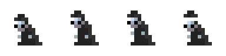 |
| `sprites/basic_test.png` | 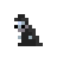 |

### Trucks And Supply Assets

| Asset | Preview |
| --- | --- |
| `sprites/truck_1.png` | 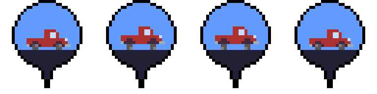 |
| `sprites/truck_2.png` | 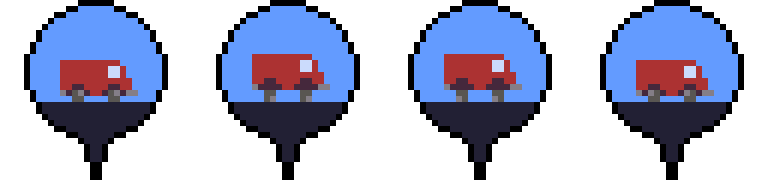 |
| `sprites/truck_3.png` | 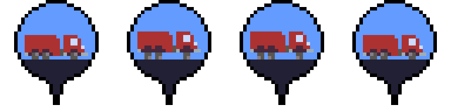 |
| `sprites/band.png` | 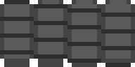 |
| `sprites/coin.png` | 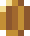 |

### Factory And Processing Assets

| Asset | Preview |
| --- | --- |
| `sprites/body_1.png` |  |
| `sprites/body_2.png` | 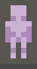 |
| `sprites/body_3.png` | 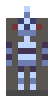 |
| `sprites/body_4.png` | 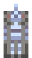 |
| `sprites/head.png` | 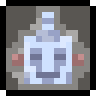 |
| `sprites/torso.png` | 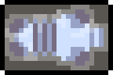 |
| `sprites/arm_1.png` | 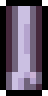 |
| `sprites/arm_2.png` | 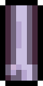 |
| `sprites/leg_1.png` |  |
| `sprites/leg_2.png` |  |
| `sprites/cut.png` | 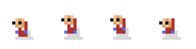 |
| `sprites/pack.png` | 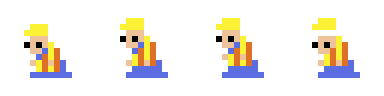 |
| `sprites/ster.png` | 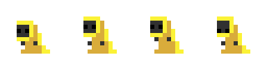 |
| `sprites/legend.png` | 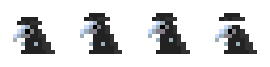 |

### Cards And Tables

| Asset | Preview |
| --- | --- |
| `sprites/card_basic.png` | 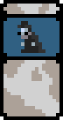 |
| `sprites/card_butch.png` |  |
| `sprites/card_cut.png` |  |
| `sprites/card_pack.png` | 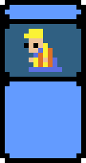 |
| `sprites/card_ster.png` |  |
| `sprites/card_legend.png` | 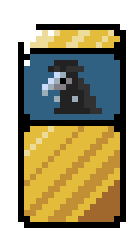 |
| `sprites/table_chop.png` | 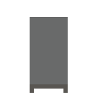 |
| `sprites/table_chop_f.png` | 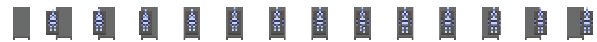 |
| `sprites/table_pack.png` | 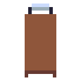 |
| `sprites/table_pack_f.png` | 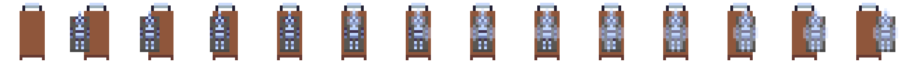 |
| `sprites/table_ster.png` | 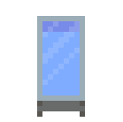 |
| `sprites/table_ster_f.png` | 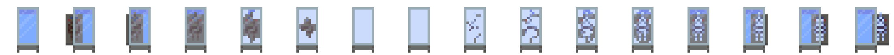 |

## Project Structure

- `scenes/` contains the Godot scenes for the menu, map, supply zone, factory zone, distribution zone, and results screen.
- `scripts/` contains shared gameplay logic, including the game manager and solver client.
- `sprites/` contains the art assets used by the game.
- `backend/` contains the Python FastAPI solver service.

## Running The Game

Open the project in Godot and run the main scene from `project.godot`.

The backend can be started separately if you want the solver endpoints available locally:

```bash
cd backend
uvicorn main:app --reload --host 0.0.0.0 --port 8000
```

For backend details, see [backend/README.md](backend/README.md).

## Notes

The game is intentionally built as an optimization-first experience. If you want, I can also add a short screenshot section for the actual Godot scenes once you export or capture them.
